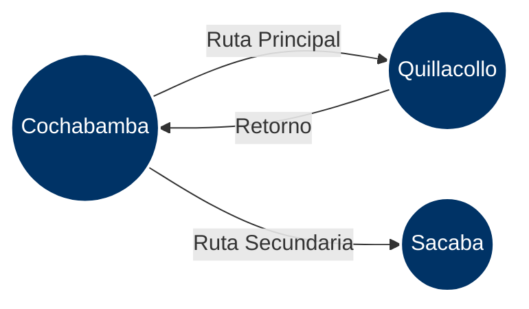

# 🗺️ FleetControl: Red de Rutas con Grafos (Práctica 9)


> **Implementación de Estructuras No Lineales:** Desarrollo de un Grafo Dirigido utilizando una Lista de Adyacencia para modelar y optimizar la red de rutas del sistema logístico "FleetControl".

## 📑 Tabla de Contenidos
- [Topología de la Red (Caso de Estudio)](#-topología-de-la-red-caso-de-estudio)
- [Arquitectura del Grafo](#-arquitectura-del-grafo)
- [Análisis de Complejidad](#-análisis-de-complejidad)
- [Estructura del Proyecto](#-estructura-del-proyecto)
- [Instrucciones de Despliegue](#-instrucciones-de-despliegue)

## 🌐 Topología de la Red (Caso de Estudio)

El sistema representa las ciudades como **Vértices (Nodos)** y las rutas de los buses como **Aristas (Edges)** dirigidas. 

El siguiente diagrama ilustra la red de transporte actual configurada en el sistema:

## 🏗️ Arquitectura del Grafo

Para garantizar el máximo rendimiento en un sistema de rutas con conexiones dispersas, se ha optado por implementar una **Lista de Adyacencia** utilizando la clase nativa `Dictionary<TKey, TValue>` de C#.

*   **Vértices:** Claves del diccionario (Nombres de las ciudades).
*   **Aristas:** Listas asociadas a cada clave que contienen los destinos accesibles desde ese origen.

Esta arquitectura evita el desperdicio de memoria que generaría una Matriz de Adyacencia, lo cual es ideal para expansiones futuras a nivel nacional.

## 📊 Análisis de Complejidad (Big O)

Sea $V$ el número de vértices (ciudades) y $E$ el número de aristas (rutas), el rendimiento teórico es:

| Operación | Complejidad | Justificación |
| :--- | :---: | :--- |
| **Agregar Vértice** | $O(1)$ | Inserción directa en el Diccionario Hash. |
| **Agregar Arista** | $O(1)$ | Adición al final de la `List<T>` de adyacencia. |
| **Buscar Conexiones** | $O(1)$ | Acceso directo a la lista mediante la llave. |
| **Memoria (Espacio)** | $O(V + E)$ | Solo se almacena la información de las rutas existentes. |

## 📂 Estructura del Proyecto
```plaintext
ESTRUCTURA_DE_DATOS/
└── ED-p9-grafos/
    ├── Grafo.cs           # Core de la estructura (Lista de Adyacencia)
    ├── Program.cs         # Simulación de la red y punto de entrada
    └── README.md
```

## ⚙️ Instrucciones de Despliegue
Requisitos Previos

    SDK de .NET.

    Git CLI.

Ejecución

    Clonar la rama de la práctica:
    Bash

    git clone -b FernandoSaavedra/ED-p9-grafos [https://github.com/fernadosaaavedra12/ESTRUCTURA_DE_DATOS.git](https://github.com/fernadosaaavedra12/ESTRUCTURA_DE_DATOS.git)

    Acceder y compilar:
    Bash

    dotnet run