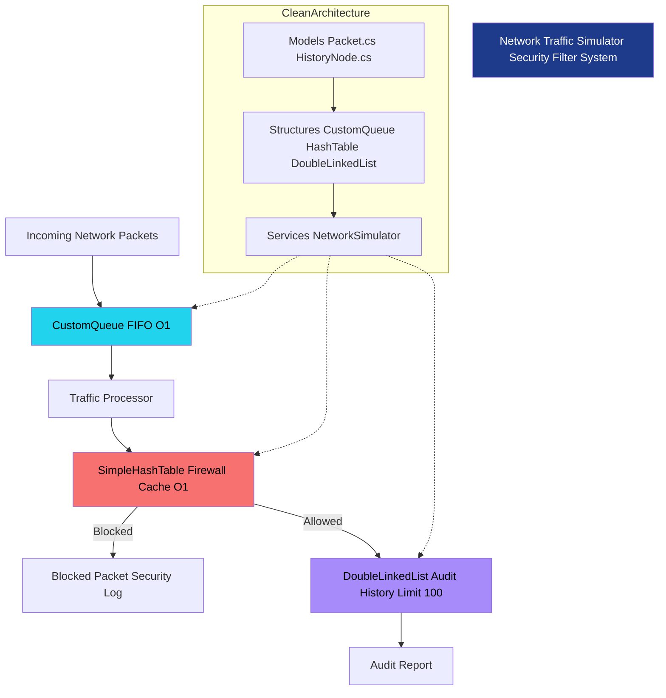

## 👨‍💻 Autor
*   **Nombre:** Fernando Hernan Saavedra
*   **Institución:** Universidad UCATEC
*   **Carrera:** Ingeniería de Sistemas


# 🌐 Network Traffic Simulator & Security Filter
### *Examen Final - Estructuras de Datos I*

Este proyecto implementa un simulador de gestión de tráfico de red de alto rendimiento, diseñado para demostrar el dominio de estructuras de datos lineales y no lineales, optimización de algoritmos y principios de arquitectura limpia (**Clean Architecture**).

---

## 🎯 Objetivos del Proyecto

El propósito de este sistema es procesar un flujo masivo de paquetes de red, aplicando filtros de seguridad en tiempo real y manteniendo un historial de auditoría. Los objetivos académicos clave son:

*   **Eficiencia Temporal:** Garantizar que la verificación de seguridad (Firewall) se realice en tiempo constante $O(1)$.
*   **Gestión de Memoria:** Implementar estructuras nativas (sin colecciones de alto nivel) para entender el manejo de punteros y referencias de memoria.
*   **Abstracción:** Separar la lógica de las estructuras (Data Structures) de la lógica de negocio (Network Services).

---

## 🛠️ Stack Tecnológico y Requisitos

| Componente | Requisito |
| :--- | :--- |
| **Lenguaje** | C# 12.0 |
| **Framework** | .NET 8.0 SDK |
| **Sistema Operativo** | Linux (Garuda/Kali) / Windows |
| **IDE/Editor** | VS Code / Visual Studio 2022 |

---

## 🏗️ Arquitectura del Proyecto

Para este proyecto se ha seleccionado una estructura modular que facilita la escalabilidad y el mantenimiento:

*   **`/Models`**: Objetos POCO (*Plain Old CLR Objects*) que representan los datos, como `Packet.cs` y `Node.cs`.
*   **`/Structures`**: El núcleo del examen. Contiene las implementaciones manuales de los Tipos Abstractos de Datos (ADTs).
*   **`/Services`**: Orquestador de la lógica; es donde las estructuras interactúan para resolver el problema de red.
*   **`Program.cs`**: Punto de entrada que inicializa el simulador.

---

## 📚 Estructuras de Datos Implementadas

### 1. Custom Queue (Buffer de Entrada)
**Propósito:** Los paquetes de red llegan de forma asíncrona. Una cola garantiza el principio **FIFO** (*First-In, First-Out*), procesando el tráfico en el orden exacto de llegada.
*   **Implementación:** Basada en nodos enlazados con punteros `Head` y `Tail`.
*   **Complejidad:** 
    *   Encolar: $O(1)$
    *   Desencolar: $O(1)$

### 2. Simple HashTable (Firewall de Seguridad)
**Propósito:** En un entorno de red, no podemos buscar una IP bloqueada recorriendo una lista ($O(n)$). Necesitamos acceso inmediato.
*   **Implementación:** Arreglo de cubetas (*Buckets*) con **manejo de colisiones por encadenamiento** (*Chaining*).
*   **Lógica de Hash:** Suma de valores ASCII de la dirección IP modulo el tamaño del arreglo.
*   **Complejidad:** Caso promedio $O(1)$.

### 3. Double Enlazada (Historial de Auditoría)
**Propósito:** Permite la navegación del historial en ambos sentidos (Reciente a Antiguo y viceversa).
*   **Implementación:** Cada nodo tiene referencias `Next` y `Previous`.
*   **Característica Especial:** Incluye un limitador automático de capacidad (100 registros) para prevenir el desbordamiento de memoria en sistemas embebidos simulados.

---

## 🚀 Instalación y Ejecución

Sigue estos pasos en tu terminal (especialmente optimizado para entornos **Linux/Garuda**):

1. **Clonar el repositorio:**
   ```bash
   git clone [https://github.com/tu-usuario/EX-Final-Estructuras.git](https://github.com/tu-usuario/EX-Final-Estructuras.git)
   cd EX-Final-Estructuras 
   ```


# PASOS PARA EJECUTAR EL PROGRAMA CORRECTAMENTE
### Crear el archivo de proyecto tipo consola
# dotnet new console

### Organizar y Crear archivos

# mkdir Models Structures Services  
### Restaurar dependencias:
### Bash

# dotnet restore

### Compilar y Ejecutar:
### Bash

# dotnet run

